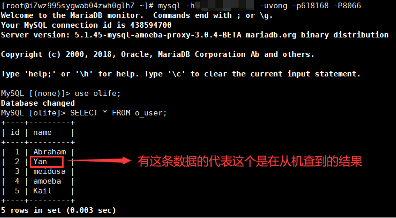
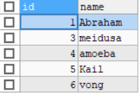

# MySQL数据库主从复制

## 准备

主机：127.0.0.1:3306

从机：127.0.0.1:3307

代理：127.0.0.1:8066


## 主机

在my.cnf里增加一项配置

``` xml
server-id=1
```

授权一个账户供给从机以vong的用户和618168的密码登录我们的主机（%代表所有ip都可连）

``` mysql
CRANT REPLICATION SLAVE ON *.* TO 'vong'@'%' IDENTIFIED BY '618168'
```

刷新已执行的命令

``` mysql
flush privileges
```

查看主机状态，找到bin文件与其当前对应的位置

``` mysql
show master status
```

## 从机

在my.cnf里增加一项配置

``` xml
server-id=2
```

连接主机

``` mysql
CHANGE MASTER TO MASTER_HOST='127.0.0.1', 
MASTER_USER='vong', 
MASTER_PASSWORD='618168', 
MASTER_LOG_FILE='mysql-bin.000019',
MASTER_LOG_POS=698
```

开启从机并查看状态

``` mysql
start slave
show slave status
```

看见这两个状态Yes才代表主从复制完成

``` bash
Slave_IO_Running:Yes
Slave_SOL_Running:Yes
```

## 测试

在主机创建的库和表都会同步到从机，从机没有写的权限，即使数据写入了表在主机也无法被查到，只会占据一行

- 从机写操作

``` mysql
INSERT INTO o_user(id,NAME) VALUES(2,'Yan')
```
- 从机查询全部


- 主机查询全部


# MySQL数据库读写分离

下载amoeba：https://sourceforge.net/projects/amoeba/

## 配置dbServers.xml

``` xml
<dbServer name="abstractServer" abstractive="true">
  <factoryConfig class="com.meidusa.amoeba.mysql.net.MysqlServerConnectionFactory">
    <property name="connectionManager">${defaultManager}</property>
    <property name="sendBufferSize">64</property>
    <property name="receiveBufferSize">128</property>

    <!-- 针对的数据库db -->
    <property name="schema">olife</property>

    <!-- 登录的用户名 -->
    <property name="user">root</property>

  </factoryConfig>
  ......
</dbServer>  

<dbServer name="master"  parent="abstractServer">
  <factoryConfig>
    <!-- 主机ip -->
    <property name="ipAddress">127.0.0.1</property>
    <!-- 监听的端口:主机数据库 -->
    <property name="port">3306</property>
    <!-- 登录3306端口主机的密码 -->
    <property name="password">666666</property>
  </factoryConfig>
</dbServer>

<dbServer name="slave"  parent="abstractServer">
  <factoryConfig>
    <!-- 从机ip -->
    <property name="ipAddress">127.0.0.1</property>
    <!-- 监听的端口:从机数据库 -->
    <property name="port">3307</property>
    <!-- 登录3307端口从机的密码 -->
    <property name="password">888888</property>
  </factoryConfig>
</dbServer>

<!-- 从机池:多个从机的组合 -->
<dbServer name="slavePool" virtual="true">
  <poolConfig class="com.meidusa.amoeba.server.MultipleServerPool">
    <!-- 负载均衡策略: 1=轮巡 , 2=权重 , 3=HA-->
    <property name="loadbalance">1</property>

    <!-- 以逗号分隔，例如: server1,server2,server1 -->
    <property name="poolNames">slave</property>
  </poolConfig>
</dbServer>

```

## 配置amoeba.xml

``` xml
<!-- service class must implements com.meidusa.amoeba.service.Service -->
<service name="Amoeba for Mysql" class="com.meidusa.amoeba.mysql.server.MySQLService">
<!-- port -->
  <property name="port">8066</property> 
  <property name="connectionFactory">
    <bean class="com.meidusa.amoeba.mysql.net.MysqlClientConnectionFactory">
      <property name="sendBufferSize">128</property>
      <property name="receiveBufferSize">64</property>
    </bean>
  </property>

  <property name="authenticateProvider">
    <bean class="com.meidusa.amoeba.mysql.server.MysqlClientAuthenticator">
      
      <!-- 自定义登录amoeba的用户名 -->
      <property name="user">vong</property>
      <!-- 自定义登录amoeba的密码 -->
      <property name="password">618168</property>

      <property name="filter">
        <bean class="com.meidusa.toolkit.net.authenticate.server.IPAccessController">
          <property name="ipFile">${amoeba.home}/conf/access_list.conf</property>
        </bean>
      </property>
     </bean>
   </property>

</service>
......
<!-- 默认选主机 -->
<property name="defaultPool">master</property>

<!-- 写选主机 -->
<property name="writePool">master</property>
<!-- 读选从机池 -->
<property name="readPool">slavePool</property>

<property name="needParse">true</property>
```

## 测试

### 启动amoeba

运行bin目录下的launcher

### 实现测试

登入amoeba代理

``` bash
mysql -P8066 -uvong -p618168 -h127.0.0.1
```

- 代理读取数据，结果跟从机的一样



- 代理写入数据，成功


- 主机的数据也同步更新了



### 宕机测试

- 停止3307端口从机


- 查询失败，但插入成功


- 开启3307端口从机


- 因为记录了上次执行位置，所以仍然查询失败

- 对此重新登录代理，再次查询，成功


